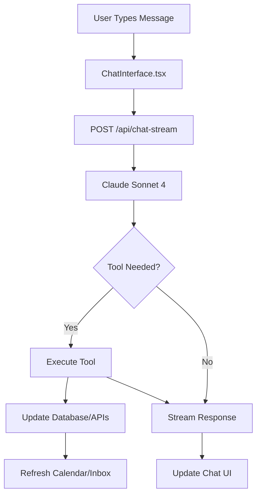

# Agent System Guide

This document explains how the AI chat agent works in our Calendar Assistant + Inbox Concierge application. The agent uses Claude Sonnet 4 with streaming responses and tool calling to provide natural language interactions for calendar and email management.

## 🧠 How the Agent Works

### Architecture Overview

The agent system consists of several key components working together:

1. **ChatInterface.tsx** - Frontend chat UI with streaming support
2. **chat-stream API** - Server-side streaming endpoint  
3. **Claude Sonnet 4** - AI model with tool calling capabilities
4. **Tool Registry** - Available functions the AI can execute
5. **Real-time Updates** - Immediate UI refresh after operations



### Real User Conversation Example

Here's an actual conversation showing how the agent handles complex requests:

**User**: "What meetings do I have today?"

**Agent**: "I'll check your calendar for today's meetings."

*⏺ Calling list_events with timeMin: 2025-08-18T00:00:00Z, timeMax: 2025-08-18T23:59:59Z*

*⎿ Found 3 events for today*

**Agent**: "Here are your meetings today:

1. **Team Standup** - 9:00 AM to 9:30 AM
2. **Product Review** - 2:00 PM to 3:00 PM  
3. **1-on-1 with Sarah** - 4:00 PM to 4:30 PM

You have about 4.5 hours of free time between meetings. Would you like me to help schedule anything else?"

**User**: "Schedule a 30-minute focus block before the standup"

**Agent**: "I'll create a 30-minute focus block before your 9 AM standup."

*⏺ Calling create_event with title: Focus Block, start: 2025-08-18T08:00:00Z, end: 2025-08-18T08:30:00Z*

*⎿ Event created successfully*

**Agent**: "✅ Created **Focus Block** from 8:00 AM to 8:30 AM. This gives you 30 minutes of focused time before your standup meeting."

## 🛠️ Available Tools

The agent has access to several tools for managing calendars and emails:

### Calendar Management Tools

#### `list_events`
**Purpose**: Retrieve calendar events for a specific time range

**Example Usage**:
```typescript
{
  "name": "list_events",
  "parameters": {
    "timeMin": "2025-08-18T00:00:00Z",
    "timeMax": "2025-08-18T23:59:59Z",
    "maxResults": 10
  }
}
```

**Sample Response**:
```json
{
  "success": true,
  "events": [
    {
      "id": "abc123",
      "summary": "Team Meeting",
      "start": { "dateTime": "2025-08-18T14:00:00Z" },
      "end": { "dateTime": "2025-08-18T15:00:00Z" },
      "description": "Weekly team sync"
    }
  ]
}
```

#### `create_event`
**Purpose**: Create new calendar events

**Example Usage**:
```typescript
{
  "name": "create_event",
  "parameters": {
    "summary": "Product Planning Session",
    "start": "2025-08-20T10:00:00",
    "end": "2025-08-20T11:30:00",
    "description": "Q4 product roadmap discussion",
    "location": "Conference Room B"
  }
}
```

#### `update_event`
**Purpose**: Modify existing events

**Example Usage**:
```typescript
{
  "name": "update_event",
  "parameters": {
    "eventId": "abc123",
    "summary": "Updated Team Meeting",
    "start": "2025-08-18T14:30:00",
    "end": "2025-08-18T15:30:00"
  }
}
```

#### `delete_event`
**Purpose**: Remove events from calendar

**Example Usage**:
```typescript
{
  "name": "delete_event",
  "parameters": {
    "eventId": "abc123"
  }
}
```

### Email Management Tools

#### `list_threads`
**Purpose**: Retrieve email threads from Gmail

**Example Usage**:
```typescript
{
  "name": "list_threads",
  "parameters": {
    "options": {
      "q": "is:unread",
      "maxResults": 20
    }
  }
}
```

#### `classify_emails`
**Purpose**: Trigger email classification system

**Example Usage**:
```typescript
{
  "name": "classify_emails",
  "parameters": {
    "force": true
  }
}
```

## 💬 System Prompts & Behavior

### Core System Prompt

The agent is configured with this foundational prompt:

```
You are an AI assistant integrated into a Calendar Assistant + Inbox Concierge application. 

Your primary role is to help users manage their calendar and emails through natural conversation. You have access to tools that can:

1. View, create, update, and delete calendar events
2. Read and classify emails
3. Organize email categories

Key behaviors:
- Always be helpful and proactive
- Confirm before making destructive changes (deletions)
- Provide clear summaries of what you've done
- Suggest relevant follow-up actions
- Handle multiple requests in a single message when appropriate

When users ask about their schedule, emails, or want to create events, use the appropriate tools to help them accomplish their goals efficiently.
```

### Conversation Patterns

#### Pattern 1: Information Retrieval
**User Request**: "What's on my calendar this week?"

**Agent Process**:
1. Calculate date range for current week
2. Call `list_events` with appropriate timeMin/timeMax
3. Parse and format results
4. Present organized summary with times and details

#### Pattern 2: Event Creation
**User Request**: "Schedule a dentist appointment next Tuesday at 3pm"

**Agent Process**:
1. Parse natural language (next Tuesday, 3pm)
2. Convert to ISO 8601 format
3. Ask for duration if not specified
4. Call `create_event` with details
5. Confirm creation with formatted details

#### Pattern 3: Email Analysis
**User Request**: "How many unread emails do I have?"

**Agent Process**:
1. Call `list_threads` with unread filter
2. Count results
3. Provide summary with categories if classified
4. Suggest actions (classify, review, etc.)

## 🔧 Technical Implementation

### Streaming Architecture

The agent uses Server-Sent Events (SSE) for real-time communication:

```typescript
// Frontend streaming consumption
const response = await fetch('/api/chat-stream', {
  method: 'POST',
  headers: { 'Content-Type': 'application/json' },
  body: JSON.stringify({ 
    message: userInput,
    conversation: previousMessages 
  }),
});

const reader = response.body?.getReader();
const decoder = new TextDecoder();

while (true) {
  const { done, value } = await reader.read();
  if (done) break;
  
  const chunk = decoder.decode(value);
  // Parse SSE events: claude_response, tool_call, tool_result
}
```

### Tool Execution Flow

```typescript
// Server-side tool handling
export async function POST(request: NextRequest) {
  const stream = new ReadableStream({
    async start(controller) {
      // Send user message to Claude
      const anthropicResponse = await anthropic.messages.create({
        model: "claude-3-5-sonnet-20241022",
        messages: conversation,
        tools: availableTools,
        stream: true
      });

      for await (const chunk of anthropicResponse) {
        if (chunk.type === 'tool_use') {
          // Execute tool function
          const result = await executeToolFunction(chunk.name, chunk.input);
          
          // Send tool result back to Claude
          sendEvent(controller, 'tool_result', result);
        }
        
        if (chunk.type === 'content_block_delta') {
          // Stream Claude's response
          sendEvent(controller, 'claude_response', chunk.delta.text);
        }
      }
    }
  });
  
  return new Response(stream);
}
```

### Error Handling & Recovery

The agent includes comprehensive error handling:

```typescript
// Tool execution with error recovery
async function executeToolFunction(name: string, input: any) {
  try {
    const result = await toolFunctions[name](input);
    
    return {
      success: true,
      data: result,
      tool: name,
      summary: generateSuccessSummary(name, result)
    };
    
  } catch (error) {
    console.error(`Tool ${name} failed:`, error);
    
    return {
      success: false,
      error: error.message,
      tool: name,
      summary: `Failed to execute ${name}: ${error.message}`
    };
  }
}
```

## 🎯 Example Conversations

### Complex Multi-Step Request

**User**: "I need to prepare for my product review meeting tomorrow. Show me what's scheduled and block 2 hours before it for prep work."

**Agent Process & Response**:

*⏺ Looking up tomorrow's events*

*⎿ Found 4 events tomorrow*

"I found your **Product Review** meeting tomorrow at 2:00 PM to 3:00 PM. Let me block 2 hours before it for preparation."

*⏺ Creating prep time block from 12:00 PM to 2:00 PM*

*⎿ Prep block created successfully*

**Agent**: "✅ All set! Here's your tomorrow schedule:

**Morning**:
- 9:00 AM - Team Standup (30 min)
- 10:00 AM - *Free time*

**Afternoon**:
- 12:00 PM - **Product Review Prep** (2 hours) 📝 *Just created*
- 2:00 PM - **Product Review Meeting** (1 hour)
- 4:00 PM - Client Call (1 hour)

You now have a dedicated 2-hour prep block right before your review. Would you like me to add any specific agenda items to the prep time?"

### Email Management Flow

**User**: "Show me my unread emails and organize them by category"

**Agent Process & Response**:

*⏺ Fetching unread email threads*

*⎿ Found 12 unread emails*

*⏺ Running email classification*

*⎿ Classification completed - 12 emails categorized*

**Agent**: "I found 12 unread emails and organized them into categories:

📧 **Financial** (3 emails):
- PayPal payment confirmation
- Bank statement ready
- Invoice from Lambda Cloud

📰 **Newsletters** (4 emails):
- Weekly AI news digest
- Medium daily highlights  
- SEO marketing updates
- Research alerts

💼 **General** (3 emails):
- Domain renewal reminder
- WeWork booking confirmation
- Meeting reschedule request

🔔 **System Notifications** (2 emails):
- GitHub deployment status
- Server maintenance notice

Would you like me to help you process any of these categories first? I recommend starting with **Financial** items as they might need immediate action."

## 🚀 Advanced Features

### Context Awareness

The agent maintains context across conversations:

```typescript
// Context tracking in chat store
interface ChatMessage {
  id: string;
  role: 'user' | 'assistant';
  content: string;
  timestamp: Date;
  tools_used?: string[];
  context?: {
    events_referenced?: string[];
    emails_processed?: number;
    categories_created?: string[];
  };
}
```

### Proactive Suggestions

The agent offers helpful suggestions based on current state:

**After creating an event**:
> "✅ Meeting created! Since this is with an external client, would you like me to send them a calendar invite or set a reminder to prepare an agenda?"

**After classifying emails**:
> "I noticed several unread financial emails. Would you like me to prioritize these for review, or would you prefer to handle the urgent items first?"

### Safety Features

- **Confirmation for deletions**: Always asks before deleting events
- **Data validation**: Checks for valid dates and required fields  
- **Error recovery**: Gracefully handles API failures
- **Rate limiting**: Respects Google API quotas

## 🎨 UI Integration

### Real-time Updates

When the agent makes changes, the UI updates immediately:

```typescript
// Calendar refresh after event operations
if (data.tool && calendarTools.includes(data.tool)) {
  setTimeout(() => refreshCalendar(), 500);
}

// Email refresh after classification
if (data.tool === 'classify_emails') {
  setTimeout(() => refreshInbox(), 1000);
}
```

### Visual Feedback

Users see clear indicators of agent actions:

- **⏺ Tool Call**: Shows what the agent is doing
- **⎿ Tool Result**: Confirms completion with summary
- **✅ Success**: Clear completion indicators
- **❌ Error**: Helpful error messages with suggestions

## 🔮 Future Enhancements

### Planned Features

1. **Multi-step Workflows**: Chain complex operations
2. **Smart Scheduling**: Suggest optimal meeting times
3. **Email Intelligence**: Summarize important emails
4. **Integration Expansion**: Slack, Notion, etc.
5. **Voice Interface**: Speech-to-text for hands-free use

### Extensibility

The agent system is designed for easy expansion:

```typescript
// Adding new tools
const newTool = {
  name: "summarize_document",
  description: "Summarize documents using AI",
  parameters: { /* schema */ },
  function: async (input) => { /* implementation */ }
};

// Register tool
toolRegistry.register(newTool);
```

The agent system demonstrates how modern AI can provide natural, conversational interfaces for complex productivity tasks while maintaining reliability and user trust through clear feedback and safety measures.

---

**💡 Key Takeaway**: The agent succeeds because it combines powerful AI reasoning with reliable tool execution, clear user feedback, and thoughtful error handling to create truly useful conversational productivity assistance.